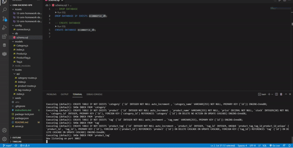
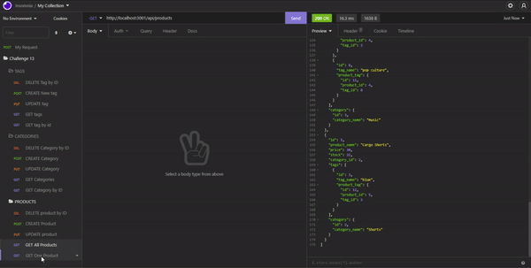
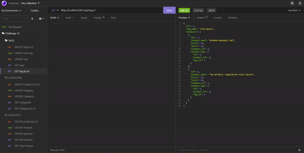

# 13 Object Relational Mapping (ORM): E-commerce Back End

## Objective:
* Build back-end for an e-commerce site by utilizing an Express.js API, Sequelize and a MYSQL database

## Project Criteria 
* Able to connect to a database using Sequelize and an environment variable file in order to protect the MySQL login
* Once the schema and seed commands are entered, a database is created and seeded with test data
* Once the application is invoked, the server is started and the Sequelized models are synced to the MySQL database
* When the API GET routes for category, product, and tag are opened in Insomnia, the data is shown in JSON format
* When the API POST, PUT, and DELETE routes are tested, they function as designed

## Built With:
* Javascript
* Sequelize
* MySQL2
* Dotenv
* Express

## Instructions
Clone the repository. Install the necessary packages with "npm install", then run the program in the terminal with "npm start". You will need to use Insomnia to test the routes.

## Animations

* GET routes to return all categories, products and tags

* GET routes to return single category, product, or tag

* POST, PUT, and DELETE routes for categories, products and tags

## Links
💀 [Demonstration Video](https://watch.screencastify.com/v/GGi19G9BHRSQJS4ZRiuv)\
👻 [Repo](https://github.com/RPB543/ORM-backend-rpb)\
☠️ [Github](https://github.com/RPB543)
